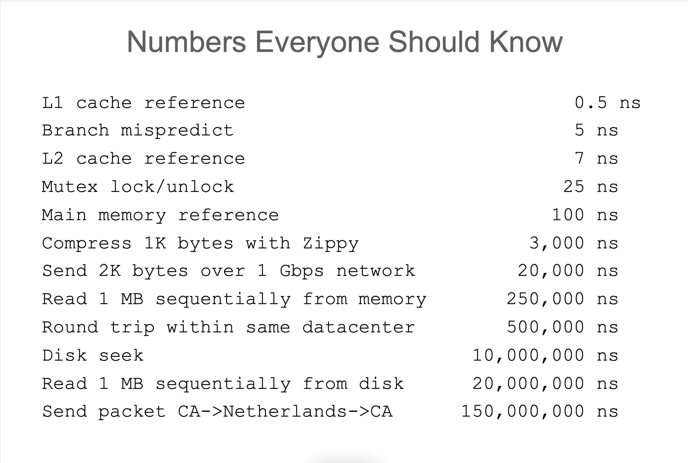

# A brief introduction to GEE

Google Earth Engine is a powerful tool for building small-to-medium complexity GIS
projects, prototyping complex GIS workflows, and exporting from a vast collection
of datasets maintained by google (with plenty of assistance from the USGS, NASA,
and other data providers).

## Why use GEE?

It was among the first large, open examples of 'cloud-native' geospatial computing.
'Cloud-native' continues to be one of the central areas for ongoing research and
development in the world of GIS, as it avoids painful bottlenecks that are all too
common when working with imagery. In a nutshell: imagery is big and we pay a premium
in terms of time as well as egress costs from cloud providers (AWS, Azure, etc.)
whenever data has to be moved from cloud providers to some external source of
compute.

Not so with 'cloud-native' processing. Instead, users supply workflow definitions
in the form of scripts and Google runs computations on its own infrastructure
*right next to the data*. That's a big deal. How big of a deal is it? Here is a
rough idea about how significant these performance distances can be extracted from
[a presentation](http://www.cs.cornell.edu/projects/ladis2009/talks/dean-keynote-ladis2009.pdf)
put together by Jeff Dean, a Google fellow:

## Not quite the Javascript you know and love...

One unfortunate side effect of running many of its computations 'in the cloud'
is that semantics will be quite different from javascript in the browser. Some code runs
on the client (as you are used to) and some runs 'in the cloud' on Google servers.

Consider the questions you must ask when one of your programs in the browser doesn't work:
perhaps you investigate the variables and the data in your program with some judicious
`console.log`s. Because normal javascript running a program on some website goes step
by step, interpreting the code you've written (performing calculations and updating
values stored in variables), you can learn everything there is to know about how that
program runs simply by inspecting values and experimentally updating them. Because some
GEE objects refer to objects and structures that live their entire lives outside of your
machine, it is not possible to inspect a GEE program's logic "all the way down".

Keeping track of the client/server distinction takes some practice but keeping the distinction
in mind will help you to avoid headaches when things aren't acting like you might expect
given your experience writing Javascript for frontend applications.
Read more [here](https://developers.google.com/earth-engine/guides/client_server).

## Examples

Without further ado, let's take a look at some example scripts. Some of these examples are
lifted from https://github.com/azavea/courage-lulc. This repository contains scripts used
to infer land use on the basis of remotely sensed imagery and might be of interest as a
jumping off point for similar work. Feel free to contact me to discuss the project in
greater detail.

1. [Exporting images](https://github.com/azavea/courage-lulc/blob/master/modis-bootstrap/gee-scripts/watermask-export.js)
2. [Masking L7 imagery to remove clouds](https://github.com/azavea/courage-lulc/blob/master/modis-bootstrap/gee-scripts/l7-export.js)
3. [Masking MODIS with quality band](https://github.com/azavea/courage-lulc/blob/master/modis-bootstrap/gee-scripts/modis-export.js)
4. [Image classification](https://developers.google.com/earth-engine/apidocs/ee-classifier-smilerandomforest#examples)